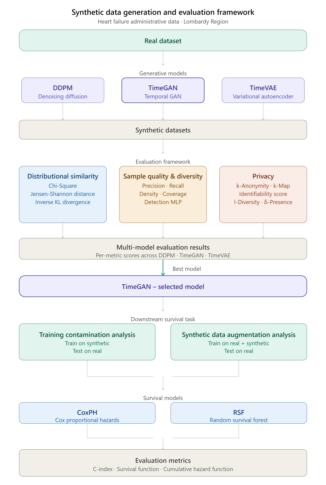

# Synthetic Data Generation and Evaluation for Heart Failure Administrative Data

This repository contains the experimental pipeline developed for the generation, evaluation, and downstream validation of synthetic healthcare data using administrative records of heart failure patients from the Lombardy Region.

The framework compares multiple deep generative models, evaluates the generated datasets from statistical, utility, and privacy perspectives, and assesses their impact on survival prediction models.

---

## Framework Overview

<p align="center">
  
</p>

The workflow consists of five main stages:

1. **Real dataset**
   - Administrative heart failure dataset.

2. **Synthetic data generation**
   - DDPM
   - TimeGAN
   - TimeVAE

3. **Synthetic data evaluation**
   - Distributional similarity
   - Sample quality and diversity
   - Privacy assessment

4. **Model selection**
   - Comparison of all generative models across evaluation metrics.
   - Selection of the best-performing generator.

5. **Downstream validation**
   - Training contamination analysis
   - Synthetic data augmentation analysis
   - Survival prediction using CoxPH and Random Survival Forest.

---

# Repository Structure

```text
.
|
├── notebooks/
│
├── docs/
│   └── thesis_evaluation_framework_pipeline_v4.png
│
├── requirements.txt
└── README.md
```

---

# Generative Models

The following models are implemented and compared.

| Model | Description |
|--------|-------------|
| **DDPM** | Denoising Diffusion Probabilistic Model for tabular/time-series generation |
| **TimeGAN** | Generative Adversarial Network designed for sequential data |
| **TimeVAE** | Variational Autoencoder for temporal/tabular data |

---

# Evaluation Framework

The synthetic datasets are evaluated using three complementary perspectives.

## 1. Distributional Similarity

Measures how closely the synthetic data reproduce the statistical properties of the real dataset.

Metrics include:

- Chi-Square
- Jensen-Shannon Distance
- Inverse KL Divergence

---

## 2. Sample Quality & Diversity

Measures whether generated samples are both realistic and sufficiently diverse.

Metrics include:

- Precision
- Recall
- Density
- Coverage
- Detection MLP

---

## 3. Privacy

Assesses disclosure risk associated with synthetic data.

Metrics include:

- k-Anonymity
- k-Map
- Identifiability Score
- l-Diversity
- δ-Presence

---

# Downstream Validation

After selecting the best synthetic data generator, the generated data are evaluated in a real machine learning task.

## Training Contamination Analysis

Train using:

- Synthetic data

Test using:

- Real data

Purpose:

Evaluate whether synthetic data encode useful predictive information without simply memorizing the original dataset.

---

## Synthetic Data Augmentation

Train using:

- Real + Synthetic data

Test using:

- Real data

Purpose:

Evaluate whether synthetic data improve predictive performance when augmenting the training set.

---

# Survival Models

Two survival prediction models are considered.

- Cox Proportional Hazards (CoxPH)
- Random Survival Forest (RSF)

Performance is evaluated using:

- Concordance Index (C-index)
- Survival Function
- Cumulative Hazard Function

---

# Installation

Clone the repository

```bash
git clone https://github.com/manuelamarenghi/synthetic_data_generation_hf_dataset.git
cd synthetic_data_generation_hf_dataset
```

Create a virtual environment

```bash
python -m venv .venv
source .venv/bin/activate
```

Install dependencies

```bash
pip install -r requirements.txt
```

---

# Usage

Typical workflow:

```text
Real Dataset
      │
      ▼
Train Generative Models
      │
      ▼
Generate Synthetic Data
      │
      ▼
Evaluate Synthetic Data
      │
      ▼
Select Best Generator
      │
      ▼
Downstream Survival Analysis
```

---

# Results

The evaluation framework produces:

- synthetic datasets generated by each model
- distributional similarity scores
- utility metrics
- privacy metrics
- comparison across generative models
- downstream survival prediction performance

---

# Citation

If you use this repository in your research, please cite:

```bibtex
@mastersthesis{marenghi2025,
  author = {Manuela Marenghi},
  title = {Synthetic Data Generation and Evaluation for Heart Failure Administrative Data},
  school = {University},
  year = {2025}
}
```

---

# License

Specify the project license (e.g. MIT, Apache-2.0, GPL-3.0).

---

# Acknowledgements

This work was developed as part of a Master's thesis on synthetic healthcare data generation and evaluation for survival analysis using administrative health records from the Lombardy Region.
